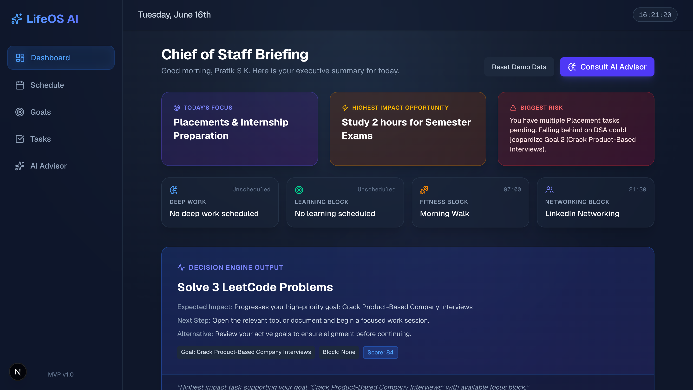
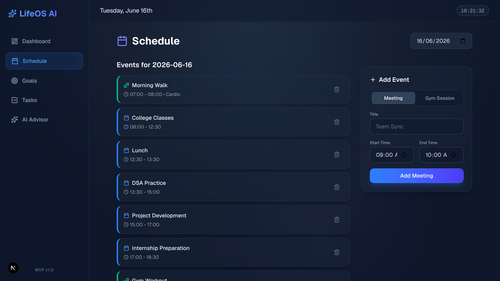
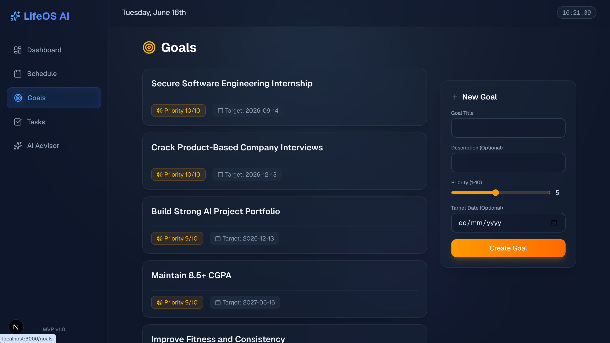
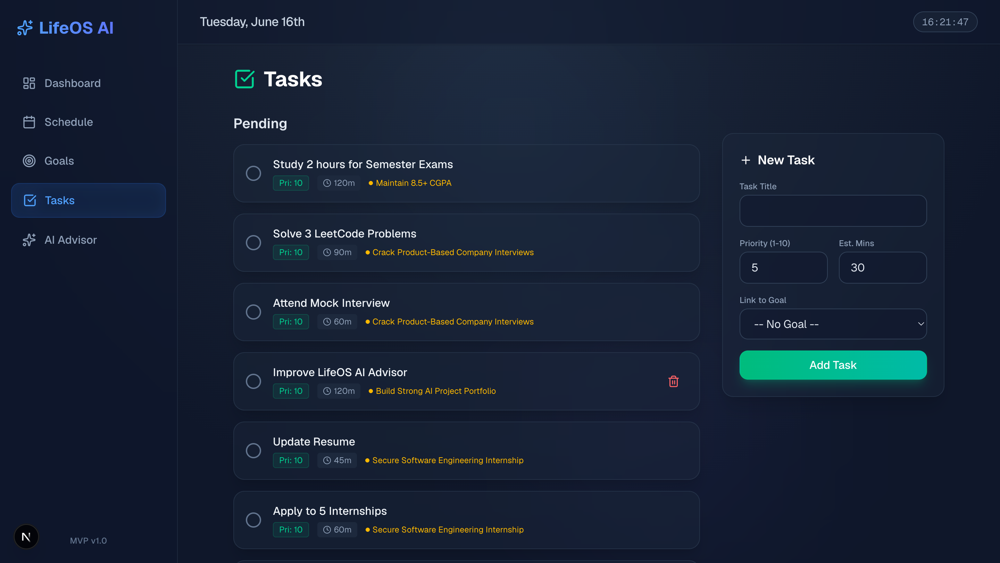
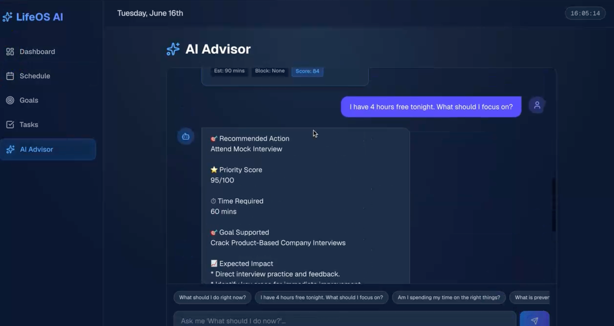

<div align="center">

# 🚀 LifeOS AI – Personal Chief of Staff

**An intelligent personal operating system that acts as an AI Chief of Staff. It analyzes schedules, goals, tasks, projects, and priorities to recommend the highest-impact actions in real time.**

<p align="center">
  
  
  
  
  
  
</p>

</div>

---

## ✨ Features

- ✅ **AI Chief of Staff:** Conversational AI advisor that understands your life context.
- ✅ **Smart Task Prioritization:** Algorithmically ranks work based on impact and deadlines.
- ✅ **Goal Tracking:** Tie daily actions directly to long-term objectives.
- ✅ **Schedule Management:** Visualize your daily timeline and protect deep work.
- ✅ **AI Decision Engine:** Computes the highest-leverage action at any given minute.
- ✅ **Personalized Recommendations:** Get executive briefings tailored to your academic and professional profile.
- ✅ **Daily Planning:** Automatically synthesize tasks into an optimal schedule.
- ✅ **Productivity Analytics:** Measure execution against goals.
- ✅ **Gemini AI Integration:** Powered by Google's state-of-the-art Gemini 2.5 Pro models.
- ✅ **Responsive Modern UI:** Glassmorphism and dark-mode aesthetic for a premium experience.

---

## 🏗️ Project Architecture

```text
User
  ↓
Dashboard
  ↓
AI Advisor
  ↓
Decision Engine
  ↓
Gemini AI
  ↓
Recommendations
```

---

## 📸 Screenshots

### Dashboard

> **Description:** Main overview of goals, tasks, schedule, and live AI recommendations.

---

### Schedule Management

> **Description:** Manage meetings, workouts, and daily events.

---

### Goals Tracking

> **Description:** Track personal and professional goals.

---

### Task Management

> **Description:** Prioritize and complete high-impact tasks.

---

### AI Advisor

> **Description:** Interact with the AI Chief of Staff.

---

## 🛠️ Tech Stack

**Frontend:**
- Next.js (App Router)
- TypeScript
- Tailwind CSS

**AI Integration:**
- Google Gemini AI SDK (`@google/generative-ai`)

**State Management:**
- React Hooks & Zustand (`useAppStore`)

**Deployment:**
- Vercel

---

## ⚙️ Installation

Follow these steps to run LifeOS AI locally on your machine.

**1. Clone repository**
```bash
git clone https://github.com/YOUR_GITHUB/life-os-advisor.git
cd life-os-advisor
```

**2. Install dependencies**
```bash
npm install
```

**3. Configure Environment Variables**
Create a `.env.local` file in the root directory and add your Google Gemini API key:
```env
GEMINI_API_KEY=YOUR_API_KEY
```

**4. Run the development server**
```bash
npm run dev
```
Open [http://localhost:3000](http://localhost:3000) to view the application.

---

## 📂 Folder Structure

```text
life-os-advisor/
├── public/                 # Static assets
├── src/
│   ├── app/                # Next.js App Router (Pages & API Routes)
│   │   ├── api/            # Backend API routes (Gemini Integration)
│   │   ├── advisor/        # AI Advisor Chat interface
│   │   └── page.tsx        # Dashboard
│   ├── components/         # Reusable UI components (shadcn/ui)
│   ├── hooks/              # Custom React hooks (useLocalStorage)
│   ├── lib/                # Core logic (Decision Engine, mockData, store)
│   └── types/              # TypeScript definitions
├── .env.local              # Environment variables
├── next.config.mjs         # Next.js configuration
├── package.json            # Dependencies
└── README.md               # Project documentation
```

---

## 🗺️ Roadmap

**Planned Features:**
- [ ] Google Calendar Integration
- [ ] File Upload Support
- [ ] AI Weekly Reports
- [ ] AI Productivity Analytics
- [ ] Habit Tracking
- [ ] Mobile App
- [ ] Voice Assistant

---

## 🤝 Contributing

Contributions are always welcome! If you have suggestions or find a bug, please follow these steps:
1. Fork the Project
2. Create your Feature Branch (`git checkout -b feature/AmazingFeature`)
3. Commit your Changes (`git commit -m 'Add some AmazingFeature'`)
4. Push to the Branch (`git push origin feature/AmazingFeature`)
5. Open a Pull Request

---

## 📄 License

Distributed under the MIT License. See `LICENSE` for more information.

---

## 👷‍♂️ Author Section

**Pratik S Kanoj**

**Artificial Intelligence & Data Science Engineer**

I am a passionate AI Engineer specializing in Machine Learning, Computer Vision, and full-stack integration. I build robust, production-ready AI systems that solve real-world problems. My expertise lies in taking complex Deep Learning architectures and deploying them into scalable, user-centric web applications.

**Technical Expertise:**

- **AI & Data Science:** Artificial Intelligence, Machine Learning, Deep Learning, Computer Vision, Generative AI, MLOps, Data Science.
- **Backend & Cloud:** Python, FastAPI, Docker, RESTful APIs.
- **Frontend:** React, JavaScript, HTML, CSS, Streamlit.

**Connect with me:**

- 💼 **LinkedIn:** [Pratik S Kanoj](https://www.linkedin.com/in/pratik-s-kanoj-a81432300/)
- 🐙 **GitHub:** [github.com/PRATIKSK7](https://github.com/PRATIKSK7)
- ✉️ **Email:** [pratiksk0077@gmail.com](mailto:pratiksk0077@gmail.com)

*If you found this project interesting or helpful, please consider giving it a ⭐ on GitHub!*

---

*Built with ❤️ using Next.js, Tailwind CSS, and Gemini AI.*
